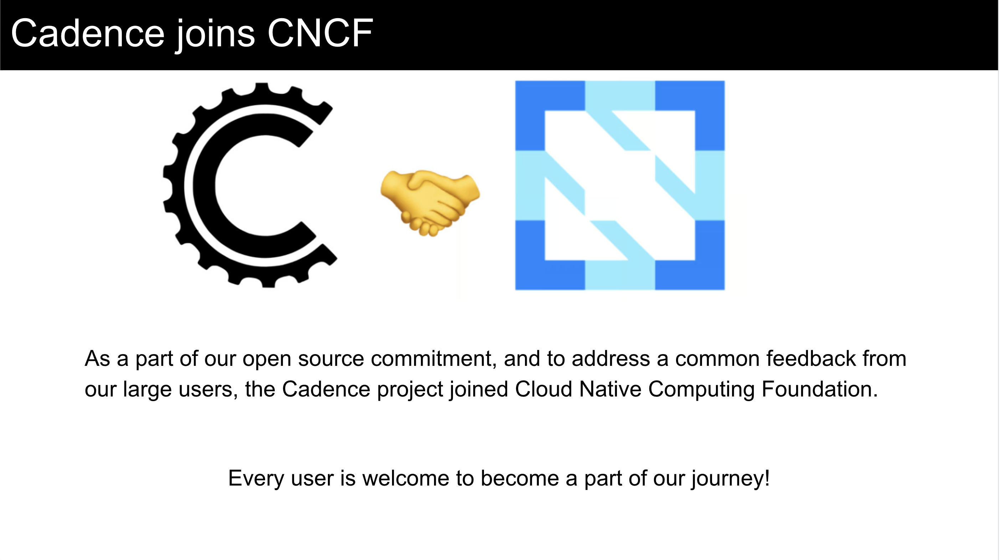
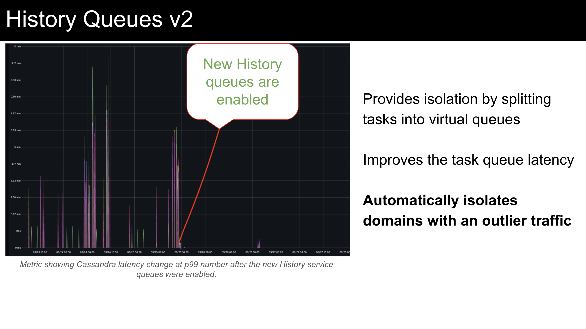
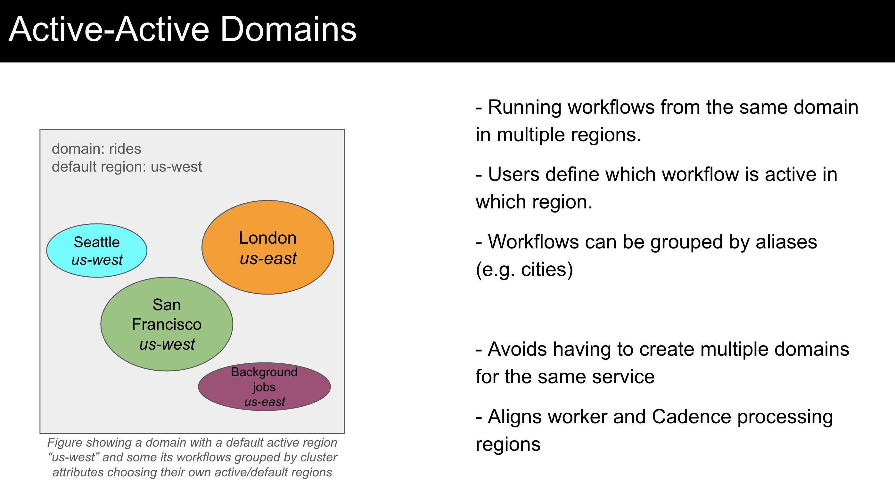
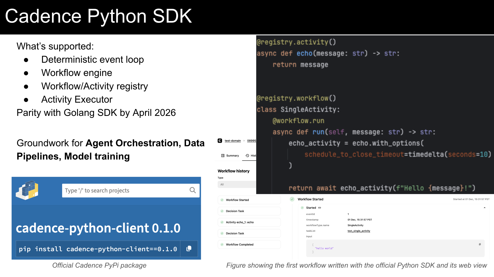
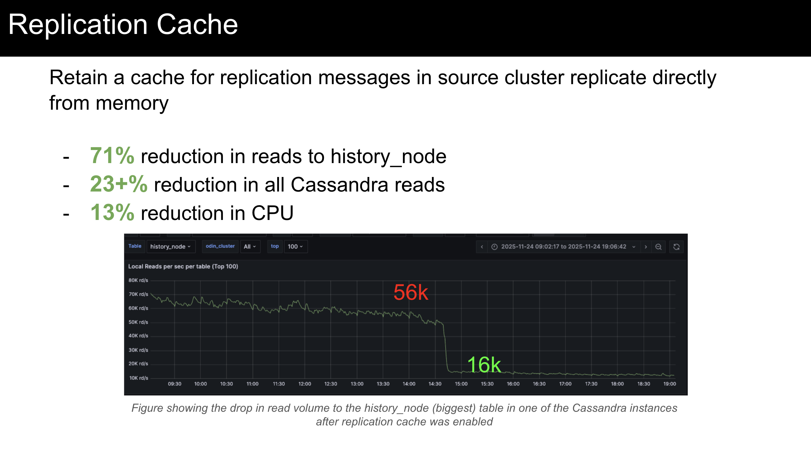
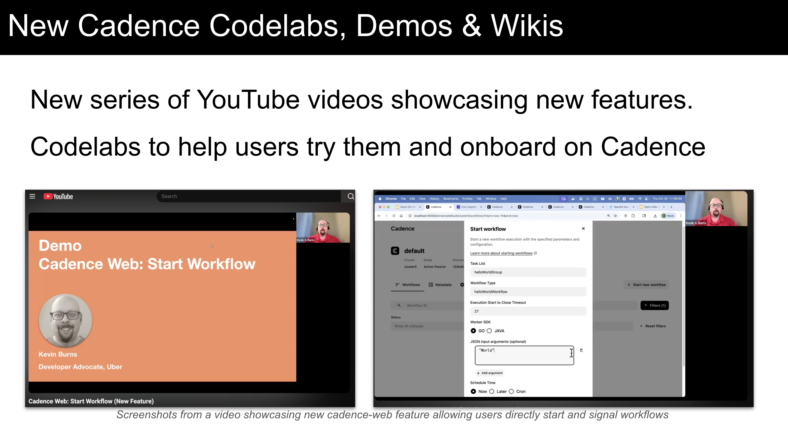
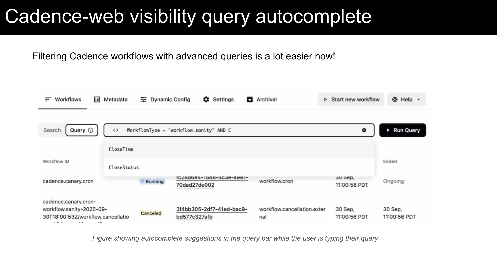

# Cadence OSS Update: 2025 Lookback

Hi Cadence Community,

At the beginning of every year, we share about what happened in the last year. Here’s a look back at our 2025 improvements, explaining what’s new, and how you can use them. 2025 was one of the most exciting years for the Cadence project and we hope this will only get better in the future. Here are some highlights:

## Cadence joins CNCF

As a sign of our open source commitment, [the Cadence project joined the Cloud Native Computing Foundation](https://cadenceworkflow.io/blog/2025/10/06/cadence-joins-cncf-cloud-native-computing-foundation) under the Linux Foundation. This is a very exciting moment for the entire project where we are moving to an entirely new plane. Similarly, we opened [our governance](https://cadenceworkflow.io/community/governance) to our users who would like to be a part of the journey. 

Our ambition is to help everyone build complex distributed systems as easily as possible and cover as many overheads in such processes as possible so engineers can get maximum value out of the Cadence project. While there’s still a lot to do to achieve that, this milestone brings us one big step closer.

Cadence is a [sandbox](https://www.cncf.io/project-metrics/) project at the moment where we receive a lot more visibility. However, [we need our users’ help](https://cadenceworkflow.io/blog/2025/11/12/help-cadence-reach-cncf-incubation) to reach the incubation level where the support we receive will significantly improve. This will happen if we can show the logos of the companies using Cadence in [ADOPTERS list](https://github.com/cadence-workflow/cadence/blob/master/ADOPTERS.md). This will also improve your experience with Cadence by having more modern features, support and non-functional improvements.

## Cadence Database Cost

We are aware that platforms like Cadence aren't the cheapest option for some users. The main source of this cost comes from underlying DB costs. In 2025, a series of efficiency and reliability improvements helped us reduce our DB cost by **60%**, which essentially made the total cost of Cadence cheaper than its cost in 2022 with much lower traffic. Note that, we have observed these improvements with Cassandra instances but other DB technologies should show similar gains.

Similar studies were [published](https://www.instaclustr.com/blog/cadence-vs-temporal-understanding-workflow-orchestration-and-temporal-cloud-pricing/) by our partners at Instaclustr by NetApp®, selling managed Cadence as a solution. 

We have many more improvements planned for 2026, which we expect to bring similar savings. Stay Tuned!

## Adaptive Tasklist Partitioning

TaskLists are a FIFO queue used to dispatch tasks to Workers. They are hosted in our matching service. By default a single tasklist lives in a single matching host. However, if a tasklist's traffic is large enough, our users used to define how many partitions they would need to have. Upon their changing traffic, they needed to keep adjusting their partitions as well. 

As it reads, that’s not the most efficient way to manage thousands of domains. Even with a single domain, this model required Cadence users to learn internal limits about Cadence services and came with unpleasant operational load. Even when this is well-established, manual tuning was almost guaranteed to be suboptimal: you’d either be underutilized or you would accumulate tasks due to not being able to keep up with them.

Therefore, we made our partitioning logic completely adaptive where the number of TaskList partitions automatically grow and shrink based on incoming traffic, providing the perfect scale. We want Cadence to be as adaptive and easy to operate as possible.

## History Queues v2

History service is the ledger service for Cadence workflows. That’s where the initiation or completion records of the tasks are kept and the next tasks are scheduled for the matching service to dispatch. 

Up until this year, the queues were only split based on shards that cross-cut all the domains in that cluster. This meant noisy neighbors with bursty traffic or with any anti-pattern behavior would impact other domains in the cluster. They would notice latency increase or other types of degradation. 

To avoid this behavior, we implemented new flexible queues where they can be explicitly allocated for certain domains or they could adaptively isolate domains with higher traffic from others so other domains wouldn’t starve. This feature not only eliminated the noisy neighbor issues in history but also reduced the overall task processing latencies.

We have some clusters where we host over 2000 domains. Features like this especially matter for such clusters and they allow us to provide high multitenancy in a safe and efficient way.

## Active-Active Domains

Cadence domains have been running in active-passive mode for years, which has been limiting for use cases requiring processing in all clusters (regions). Since late 2025, Cadence can process domains in both regions and distribute traffic based on users’ preferences within domains. This change will make your domains more flexible and more efficient due to utilizing resources in all regions.

The best part of this feature is that switching to active-active mode won’t require any migration. All domains will support active-active by default and without breaking existing behavior. While users setting “cluster attributes” while starting their workflows will be able to benefit from active-active processing; leaving these parameters empty will retain the old active-passive behavior.

This feature is currently implemented for Cassandra and the support for other DBs will come in Q1. We will also release a blog explaining how this improved related use cases, a wiki explaining how to use it and a codelab to help you try out.

## Cadence Python SDK

This is by the far the most requested feature for a long time. We know many potential Cadence users had to go with alternate solutions just because we didn’t have the Python SDK. To address this issue, since the end of 2025, we have been supporting the Python language\! Currently basic workflows can be written in Python and full parity with Golang is expected to be achieved in some time during Q1. [Our Python package](https://pypi.org/project/cadence-python-client/0.1.0/) is released in PyPi.

## Cadence Worker Auto-scaler

Similar to the adaptive tasklist partitioning mentioned above, users won’t need to tune their workers any more. In the past, our users needed to set the number of pollers by themselves. However, in online systems the traffic is never a straight line. Users cannot constantly add or reduce the number of pollers manually. 

Therefore, this is now automated\!  It not only helps users have enough resources for their traffic but also makes sure that they don’t waste their resources. Especially for users using auto-scalers based on containers’ CPU usage, this feature will make sure that users always operate at the maximum utilization they define.

## Replication Cache

Cadence orchestrates its own replication, which allows us to seamlessly migrate from one DB technology to another, one cloud provider to another etc. The way it was working in the past was that the replication messages would be generated by reading workflow tasks from the database. 

Given that replication is a continuous process between Cadence regions, we implemented a cache to keep the replication messages in memory until a replication poll message arrives so we could eliminate the DB calls due to replication. This came with a 99%+ cache hit rate, which almost entirely eliminated the DB calls due to replication, which used to be more than 20% of all DB calls. Another big benefit was for replication latencies; since we can directly serve the messages from memory, our replication latencies dropped from 13s to 2s.

## Codelabs, Video Tutorials, Blogs and new Wikis

Another area we have been focusing on was user education. This is needed for both Cadence basics or new features. For every major new feature, we are now releasing Blogs explaining the impact of the feature, wikis explaining how to use, codelabs going over instructions and videos showing our developer advocate going over the codelab so you won’t get confused or stuck at a certain step.

## Cadence Web v4

Earlier in the year, we released [cadence-web v4](https://cadenceworkflow.io/blog/2025/04/11/2025-04-11-announcing-cadence-web-v4/announcing-cadence-web-v4). It was a complete rewrite from the previous version. We migrated from Vue.js to React, completely redesigned the UI, added multi environment support, and improved the performance significantly. 

With the new changes, extending cadence-web became much simpler as you can see with the changes mentioned below. 

## New History Page

Meet the new Workflow History page in the Cadence UI! It offers significant enhancements in performance, visibility, and navigation. Key improvements include much faster loading, color-coded events, and a new navigation bar, making it much simpler to locate workflow failures and stuck activities.

## Workflow Actions in Cadence-Web

Cadence-Web is our web component which provides a user interface to view and manage Cadence workflows. One of the many features we added to cadence-web in 2025 was the ability to directly start or signal workflows from UI. This especially helped with running the initial start command for the cron workflows or internal tools waiting for user inputs.

## Workflow Diagnostics

One of the top question categories in our support channels is about diagnosing workflow failures. Most of the issues are repeating patterns that can be easily identified by experienced Cadence users. However, this may not be that obvious to new users.

In 2025, we decided to proactively show issues about workflows in the workflow summary tab where users can click details to learn more. This both reduced the number of support questions we were receiving and also helped our users self-resolve their issues a lot faster.

There’s a codelab and the tutorial video available for this feature if you’d like to try!

## Advanced Queries with Auto-complete

Cadence provides a simple SQL language to filter and list workflows. However, it’s quite possible to forget about the keywords and the syntax. In the past, you would need to visit our wikis to remember what they were to complete your query. Now we provide an autocomplete directly in the query field to help you remember\!

## Custom Workflow Controls

A very common case for some domains is to have separate documentation for their domains and workflows where the documentation describes what workflow to start or signal. Then the user would need to copy+paste the command to a terminal. You could use this for triggering a large data pipeline, training a new AI model, starting an experiment with new parameters, starting an oncall diagnostics, executing a runbook action. You decide. Cadence allows you to take action directly from your documentation.

Currently this is supported in workflow queries but this will be extended to other areas. It’s the familiar markdown format with an extension to support adding custom start and signal buttons. It’s implemented in a secure way as it doesn’t allow running javascript code inside the markdown doc. Be on the lookout for the codelab for this feature!

## What's Coming in 2026?

Thanks to past investments in building a solid foundation for Cadence, we are switching our focus to the following areas:

### Investing in Community

Our community has been growing faster recently and we are receiving regular contribution requests. We are aware that investing in our community will be the only way to scale and build the features that our community asks. Both for users and contributors, we will have more channels and easier ways to collaborate.

### Adapting Popular Features

Are you a Cadence user but you wish a specific feature was supported? Are you considering using Cadence but not having a specific feature is a deal-breaker? Please let us know. Our goal is to have Cadence to handle all the overheads regarding orchestration and distributed systems. Especially if this problem is already solved somewhere else, we are happy to build and adapt them in Cadence.

### Driving Innovation and Modernization

We are aiming to address the changing needs of our industry, including but not limited to areas such as agent orchestration.  Some already existing features need upgrades to improve their usability, flexibility and overall experience, which will also be a part of this focus.

### Improving Usability & Operability

Ease of use has been an area of growth for us for years. We are planning to

* Revisit the entire documentation
* Make more parameters adaptive
* Intuitive Web: warnings about system/domain/workflow health with UI based actions
* Operate everything from the web

### Preparing for V2

Cadence has been going through heavy refactors within the last couple of years, allowing us to ship the improvements above. This will continue with the goal of preparing for a major V2 upgrade. Some of these improvements are currently opt-in as they require some sort of migration. In V2, many of them will be turned on by default.

## Questions?

While this is an awesome list of improvements, this is only the highlights of what we have built in 2025\. Watch [our GitHub repos](https://github.com/cadence-workflow) to be aware of new changes and follow us from our communication channels [LinkedIn](https://www.linkedin.com/company/cadenceworkflow), [YouTube](https://www.youtube.com/@cadenceworkflow2989/videos), [X](https://x.com/cadenceworkflow) 

Do you need help with using them? Feel free to [contact us](https://cadenceworkflow.io/community/support).